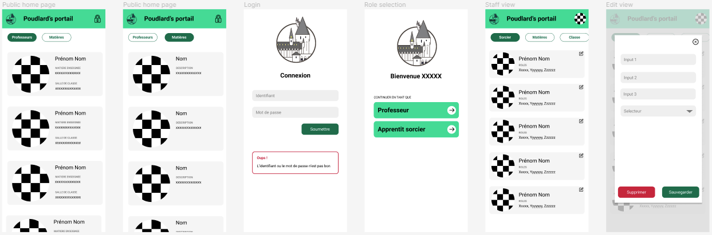
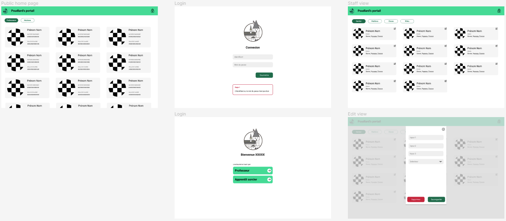
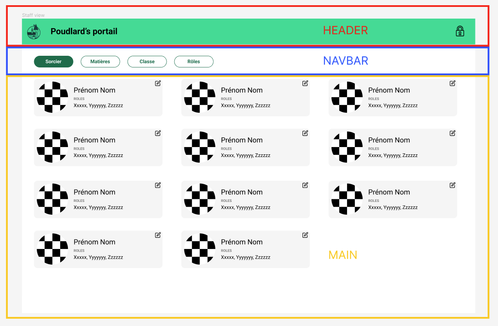
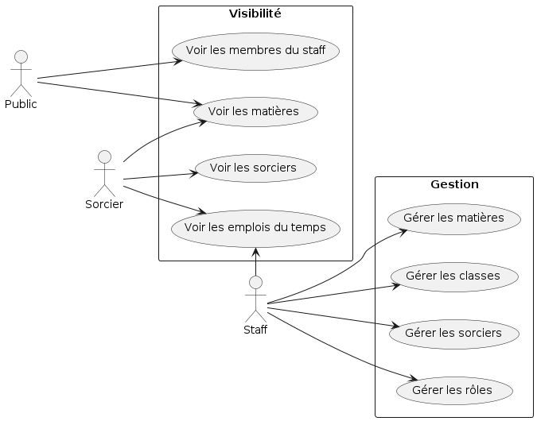
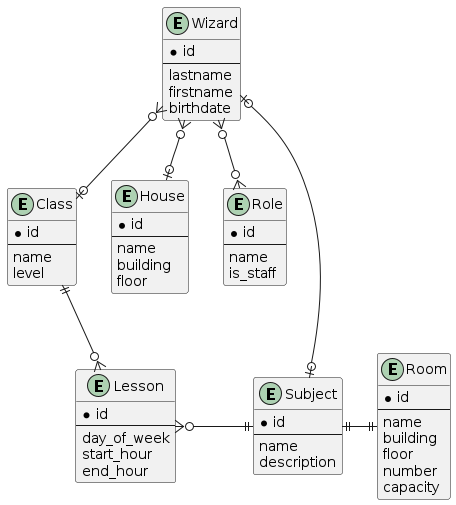
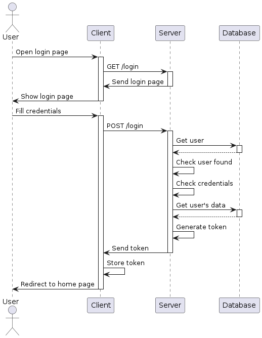
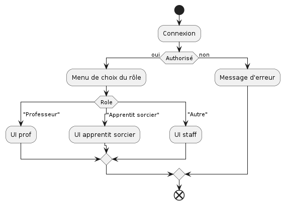

# Parcours REACT

Bienvenue dans ce parcours ! :warning: Prend bien connaissance de ce readme, toutes les todo sont à la fin.

## Objectifs

- **Appliquer** toutes les connaissances REACT vues sur les 2 saisons précédentes
- **Implémenter** une authentification JWT

## Le pitch :clapper:

**Poudlard's timetable** est une application qui permet de gérer les emplois du temps des élèves de Poudlard.

Dumbeldore et toute son équipe ont bien trop de choses à faire pour s'occuper de ça, c'est pourquoi ils ont fait appel à toi. :mage:

Le but est de pouvoir recenser les personnes évoluant à Poudlard, les matières et les classes pour pouvoir créer des emplois du temps. La partie emploi du temps sera gérée par la magie, car trop complexe. Nous allons dans un premier temps développer la partie authentification et sélection d'un rôle.

## Cahier des charges

## Maquette

Le fichier figma est disponible [ici](./assets/Poudlard's%20timetable.fig).

## Palette de couleurs

* #7B7B7B
* #F5F5F5
* #FFFFFF
* #000000
* #0C6C4A
* #13DC94
* #EFEFEF
* #CD1637
* #D9D9D9

## Zonage

### Contraintes et spécifications

- Des rôles définnissent la fonction de chaque utilisateur
- Il y a 3 grand groupes de rôles :
  - Public ; les personnes non authentifiées
  - Student ; les apprentits sorciers
  - Staff ; le personnel de l'école (ex : teacher, headmaster...)
- Un sorcier peut avoir plusieurs rôles

### Fonctionnalités finales

Voici le but de l'application finale :

- L'application doit permettre aux gérants dans l'école de Poudlard de pouvoir gérer les matières, les classes, les sorciers et les rôles.
- Les élèves pourront consulter leur emploi du temps, et ceux de leurs camarades. Ils pourront également consulter ceux des professeurs.
- La liste des non-apprentis sorciers (staff) et des matières est publique. Le reste doit être protégé par un système d'authentification.

  
Liste de toutes les user stories

  
* En tant que **visiteur**, je veux pouvoir **voir** les membres du staff
* En tant que **visiteur**, je veux pouvoir **voir** les matières
  
* En tant qu'**utilisateur**, je veux pouvoir **me connecter** à mon compte
* En tant qu'**utilisateur**, je veux pouvoir **sélectionner** le rôle avec lequel je me connecte

* En tant que **sorcier**, je veux pouvoir **voir** mon emploi du temps
* En tant que **sorcier**, je veux pouvoir **voir** la liste de mes camarades
* En tant que **sorcier**, je veux pouvoir **voir** l'emploi du temps de mes camarades
* En tant que **sorcier**, je veux pouvoir **voir** la liste des membres du staff
* En tant que **sorcier**, je veux pouvoir **voir** l'emploi du temps des membres du staff

* En tant que **membre du staff**, je veux pouvoir **ajouter** une matière
* En tant que **membre du staff**, je veux pouvoir **modifier** une matière
* En tant que **membre du staff**, je veux pouvoir **supprimer** une matière
* En tant que **membre du staff**, je veux pouvoir **ajouter** une classe
* En tant que **membre du staff**, je veux pouvoir **modifier** une classe
* En tant que **membre du staff**, je veux pouvoir **supprimer** une classe
* En tant que **membre du staff**, je veux pouvoir **ajouter** une salle
* En tant que **membre du staff**, je veux pouvoir **modifier** une salle
* En tant que **membre du staff**, je veux pouvoir **supprimer** une salle
* En tant que **membre du staff**, je veux pouvoir **ajouter** une maison
* En tant que **membre du staff**, je veux pouvoir **modifier** une maison
* En tant que **membre du staff**, je veux pouvoir **supprimer** une maison
* En tant que **membre du staff**, je veux pouvoir **ajouter** un sorcier
* En tant que **membre du staff**, je veux pouvoir **modifier** un sorcier
* En tant que **membre du staff**, je veux pouvoir **supprimer** un sorcier
* En tant que **membre du staff**, je veux pouvoir **assigner** un rôle à un sorcier
* En tant que **membre du staff**, je veux pouvoir **supprimer** un rôle à un sorcier
* En tant que **menbre du staff**, je veux pouvoir voir mon emploi du temps

N'oublie pas, on se concentre sur la partie authentification ;)

### Use cases

### Diagramme d'entités associations

### Diagramme de séquence

Système d'authentification avec token JWT :

### Diagramme d'activité

Connexion à un compte ayant plusieurs rôles :

## Déroulement

### Lancement de l'application

Tu découvriras dans le dossier `projet` le `backend` qui servira d'api pour le `frontend`. Pense à bien lire le [README](./projet/backend/README.md) du `backend`.

Une partie du `frontend` existe dans le dossier `projet`. Installe les dépendances et lance le projet en mode dev.

### Vos tâches :construction_worker:

- Créer un context d'authetification pour l'application React
- Créer la route de login qui permet de soumettre ses identifiants, puis de choisir le rôle.
- Afficher l'utilisateur connecté dans le header.

> Tips : Harry est le seul à avoir plusieurs rôles. Ses identifiants sont `Potter@poudlard.co.uk` et `poudlard`.
