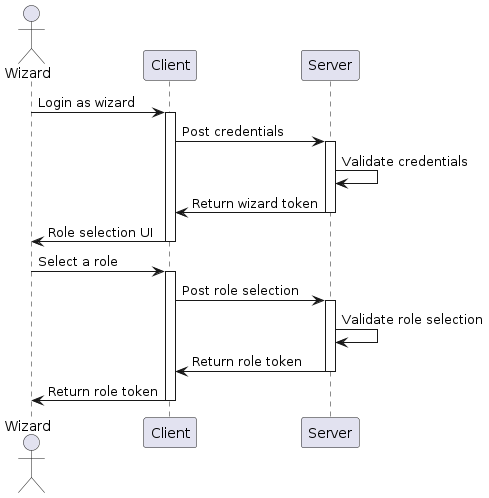

# Poudlard's API

La liste des routes disponibles est visible dans le fichier `swagger-output.json`. L'extension VSCode `Swagger Viewer` permet de visualiser le fichier dans une webview : https://marketplace.visualstudio.com/items?itemName=Arjun.swagger-viewer

## Visibilité des routes

Il y a 3 niveaux de visibilité des routes :

- **public** : accessible sans authentification
- **wizard** : accessible par un sorcier qui vient de s'authentifier sans avoir de rôle spécifique
- **role** : accessible par un sorcier authentifié et qui a un rôle spécifique

## Authentification

L'authentification se fait par le biais d'un token JWT. Ce token est généré par le serveur et doit être envoyé dans le header `Authorization` de chaque requête.



## Démarrage

1. Un fichier `init.sql` contient la structure et les données. Il faut le lancer pour créer une nouvelle base de données.
2. Dans le fichier `index.js` il faut renseigner les informations de connexion pour le client `pg`

```javascript
const client = new Client({
  user: '',
  password: '',
  host: '',
  port: 5432,
  database: '',
})
```

3. Se référer aux commandes présentes dans le fichier `package.json` pour démarrer le projet.
